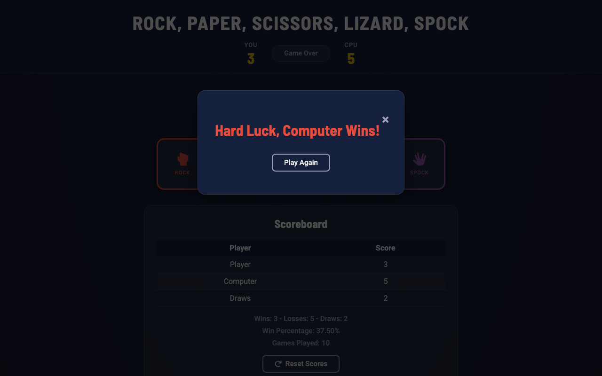
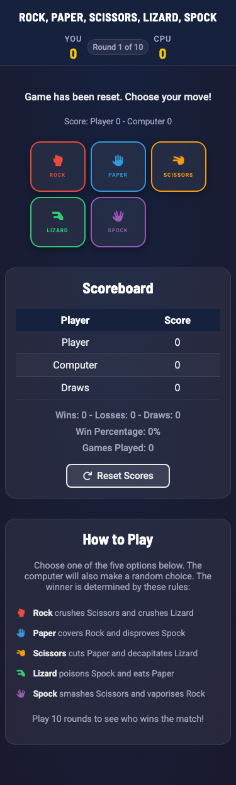
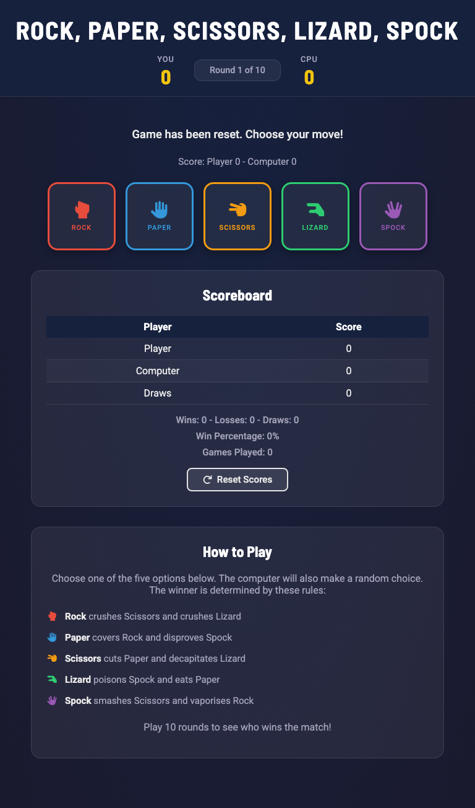

# Rock, Paper, Scissors, Lizard, Spock


## Introduction

Rock, Paper, Scissors, Lizard, Spock is an extended version of the traditional Rock, Paper, Scissors game, designed to provide more complexity and fun. This web-based game features a dark-themed responsive design, colour-coded game choices, engaging animations, and an intuitive user interface.

## Table of Contents

- [Introduction](#introduction)
- [Target Audience](#target-audience)
- [Features](#features)
- [How to Play](#how-to-play)
- [Design](#design)
- [Wireframes](#wireframes)
- [Screenshots](#screenshots)
- [Responsive Design](#responsive-design)
- [Testing](#testing)
- [Validation Testing](#validation-testing)
- [Bugs](#bugs)
- [Deployment](#deployment)
- [Local Development](#local-development)
- [Project Structure](#project-structure)
- [Dependencies](#dependencies)
- [Credits](#credits)
- [License](#license)

## Target Audience

This game is designed for:

- **Casual Gamers**: Anyone looking for a fun and quick game to play in their free time.
- **Fans of Classic Games**: Individuals who enjoy traditional games with a modern twist.
- **Developers and Students**: Those looking to learn and understand JavaScript, CSS, and HTML by examining a practical example.

## Features

- **Interactive Gameplay**: Players can choose between Rock, Paper, Scissors, Lizard, or Spock, and the game will determine the winner.
- **Colour-Coded Choices**: Each game choice has its own distinct colour (red for Rock, blue for Paper, amber for Scissors, green for Lizard, purple for Spock) for quick visual identification.
- **Header Score Bar**: Live score display in the header showing player and computer scores alongside the current round indicator.
- **Scoreboard**: Detailed scoreboard section tracking wins, losses, draws, win percentage, and games played.
- **Dynamic Score Display**: All scores update in real time after each round, with a pulse animation on score changes.
- **Colour-Coded Results**: Win messages appear in green, losses in red, and draws in amber for instant visual feedback.
- **How to Play Section**: Explains the game rules with colour-coded icons matching each choice.
- **Responsive Design**: Fully responsive across mobile, tablet, and desktop using CSS Grid and Flexbox layouts.
- **Dark Theme**: Modern dark UI with a deep navy background and vibrant accent colours for a polished game experience.
- **CSS Custom Properties**: Design tokens defined as CSS variables for consistent styling throughout the application.
- **Accessible Design**: Skip navigation link, ARIA attributes, keyboard navigation support, visible focus indicators, and `prefers-reduced-motion` support.
- **Reset Function**: Allows players to reset scores and start fresh at any time.
- **Game End Modal**: Displays the final match result in an animated modal popup after 10 rounds, with colour-coded messages for win, loss, or draw outcomes and a Play Again button.

## How to Play

Each player picks one of five options. The winner is determined by these rules:

- **Rock** crushes Scissors and crushes Lizard
- **Paper** covers Rock and disproves Spock
- **Scissors** cuts Paper and decapitates Lizard
- **Lizard** poisons Spock and eats Paper
- **Spock** smashes Scissors and vaporises Rock

Play 10 rounds to determine the overall winner!

## Design

### Colour Scheme

The game uses a dark theme with a deep navy background and vibrant accent colours defined as CSS custom properties:

| Element | Colour | Hex |
|---------|--------|-----|
| Background | Deep Navy | `#1a1a2e` |
| Card Background | Semi-transparent White | `rgba(255, 255, 255, 0.06)` |
| Rock | Red | `#e74c3c` |
| Paper | Blue | `#3498db` |
| Scissors | Amber | `#f39c12` |
| Lizard | Green | `#2ecc71` |
| Spock | Purple | `#9b59b6` |
| Score Accent | Gold | `#f1c40f` |
| Win Result | Green | `#2ecc71` |
| Loss Result | Red | `#e74c3c` |
| Draw Result | Amber | `#f39c12` |

### Typography

- **Headings**: Barlow Semi Condensed (weights 600, 700) for a strong game identity
- **Body/UI text**: Roboto (weights 400, 500, 700) for readability

Both fonts are loaded from Google Fonts.

## Wireframes

The following wireframes outline the key pages of the game:

- **Home Page**: Includes the title, score bar, game options, scoreboard, and rules section.
- **Game Page**: Displays the game interface with colour-coded interactive buttons for player choices.


## Screenshots

- **Home Page**: Showcases the main interface with the dark theme, score bar, colour-coded game buttons, and scoreboard.


- **Game Results**: Displays the game after several rounds with updated scores, a colour-coded result message, and live statistics.


- **Game Over Modal**: Shows the animated modal that appears after 10 rounds with the final result and a Play Again button.


## Responsive Design

The game is fully responsive and adapts to different screen sizes, ensuring a seamless experience across desktops, tablets, and mobile devices.

- **Desktop (1280px+)**: Five game buttons displayed in a horizontal row with generous spacing.
- **Tablet (768px)**: Buttons remain in a row with slightly larger touch targets (110x110px).
- **Mobile (375px)**: Buttons arranged in a 3-column grid (3 top + 2 bottom) for comfortable tapping.
- **Small Mobile (320px)**: Compact grid layout with scaled-down elements while maintaining minimum 44x44px touch targets.

### Mobile View


### Tablet View


### Responsive Design Test


## Testing

The game has undergone several manual tests to ensure that it works as intended on various devices and browsers. Below are the key areas of testing:

1. **Responsiveness**
   - **Tested on**: Desktop, Laptop, Tablet, and Mobile devices.
   - **Tested viewports**: 320px, 375px, 768px, 1280px.
   - **Outcome**: The game is fully responsive and displays correctly on all screen sizes. All game buttons exceed the 44x44px minimum touch target at every viewport.

2. **Cross-Browser Compatibility**
   - **Tested Browsers**:
     - Google Chrome
     - Mozilla Firefox
     - Microsoft Edge
     - Safari
   - **Outcome**: The game works consistently across all browsers.

3. **Game Logic**
   - **Tested Areas**:
     - Player move selection
     - Score updates (header score bar, inline score, and scoreboard table)
     - Win/loss/draw tracking with colour-coded result messages
     - Round indicator updates correctly each round
     - Game end modal after 10 rounds with correct win/loss/draw message
     - Play Again button resets and closes modal
     - Reset functionality clears all scores and displays confirmation message
   - **Outcome**: The game logic works as expected, and all scores update correctly throughout gameplay.

4. **Accessibility**
   - **Tested Areas**:
     - Skip navigation link functions correctly
     - All interactive elements keyboard-navigable
     - Visible focus indicators on all buttons and close button
     - Screen reader announces results via `aria-live="polite"` region
     - Modal has correct `role="dialog"` and `aria-modal="true"` attributes
     - All decorative icons have `aria-hidden="true"`
     - Animations respect `prefers-reduced-motion` preference
   - **Outcome**: The game meets WCAG 2.1 Level AA accessibility standards.

5. **Performance Testing**
   - **Tested using Lighthouse**:
     - **Performance**: 99
     - **Accessibility**: 100
     - **Best Practices**: 100
     - **SEO**: 100


## Validation Testing

All code has been validated using official validation tools to ensure it meets web standards.

### HTML Validation

- **Tool**: [W3C Markup Validation Service](https://validator.w3.org/)
- **Result**: No errors found. The HTML document passes validation with no issues.

### CSS Validation

- **Tool**: [W3C CSS Validation Service (Jigsaw)](https://jigsaw.w3.org/css-validator/)
- **Result**: No errors found. The CSS file passes validation with no issues.

### JavaScript Validation

- **Tool**: [JSHint](https://jshint.com/)
- **Result**: No significant issues found. The JavaScript code passes validation without errors.

## Bugs

### Fixed Bugs

- **Score display not updating:** The "Score: Player 0 - Computer 0" line in the game area did not update during gameplay. This was caused by the `updateScoreboard()` function not targeting the `player-score-result` and `computer-score-result` span elements. Fixed by adding these elements to the function so both the scoreboard table and the score display line update after each round.
- **Duplicate function definition:** The `showFinalMessage()` function was defined twice in the JavaScript file. The first version used a browser `alert()` popup, while the second used a styled modal. The second definition silently overwrote the first. Fixed by removing the `alert()` version and keeping only the modal version.
- **HTML validation error:** A `<style>` element was placed inside the `<body>`, which is not valid HTML. Fixed by moving the Google Fonts `@import` to the external CSS file and removing the redundant Font Awesome `@import` that was already loaded via a `<link>` element in the `<head>`.
- **Inline event handlers:** All buttons used inline `onclick` attributes, which caused JSHint to flag the functions as unused and did not follow separation of concerns. Fixed by removing all `onclick` attributes and attaching event listeners in the JavaScript file using `addEventListener`.
- **Game over modal did not handle draws:** The `showFinalMessage()` function only checked if the player won and otherwise displayed "Computer Wins", even when scores were tied. Fixed by adding an `else if` condition to display "It's a Draw! Well Played!" when scores are equal.

### Unfixed Bugs

- No known unfixed bugs.

## Deployment

This project is deployed using GitHub Pages. The following steps were used to deploy the site:

1. Navigate to the [GitHub repository](https://github.com/antfildes10/Project-2).
2. Click on the **Settings** tab.
3. In the left sidebar, click on **Pages**.
4. Under **Source**, select **Deploy from a branch**.
5. Under **Branch**, select **main** and **/ (root)**, then click **Save**.
6. The site will be deployed automatically. The live link will appear at the top of the GitHub Pages section once the deployment is complete.

The live site can be accessed at: https://antfildes10.github.io/Project-2/

## Local Development

### Cloning the Repository

To clone this repository and run the project locally:

1. Navigate to the [GitHub repository](https://github.com/antfildes10/Project-2).
2. Click the **Code** button and copy the HTTPS URL.
3. Open your terminal and run:
   ```bash
   git clone https://github.com/antfildes10/Project-2.git
   ```
4. Navigate into the project folder:
   ```bash
   cd Project-2
   ```
5. Open `index.html` in your web browser to play the game.

### Forking the Repository

1. Navigate to the [GitHub repository](https://github.com/antfildes10/Project-2).
2. Click the **Fork** button in the top right corner.
3. This creates a copy of the repository in your own GitHub account.

## Project Structure

```
Project-2/
├── index.html                     # Main HTML file
├── README.md                      # Project documentation
├── assets/
│   ├── css/
│   │   └── style.css              # CSS styles and design tokens
│   └── js/
│       └── script.js              # JavaScript game logic
└── documentation/
    └── read-me-media/
        ├── am-i-responsive.png    # Responsive design screenshot
        ├── game-over-modal.png    # Game over modal screenshot
        ├── game-wireframe.png     # Wireframe screenshot
        ├── lighthouse-scores.png  # Lighthouse test results
        ├── main-page.png          # Main page screenshot
        ├── main-page-results.png  # Game results screenshot
        ├── mobile-view.png        # Mobile layout screenshot
        └── tablet-view.png        # Tablet layout screenshot
```

## Dependencies

- **Font Awesome**: Used for game choice icons.
- **Google Fonts**: Barlow Semi Condensed (headings) and Roboto (body text) used for styling.

## Credits

This project was made possible with the help of various resources for learning HTML, CSS, and JavaScript:

- **W3Schools**: Comprehensive tutorials on web development.
- **MDN Web Docs**: Excellent documentation for web standards and best practices.
- **Microsoft Copilot**: Provided guidance on project structure and content.
- **Claude Code (Anthropic)**: Provided guidance on code quality and best practices.

## License

This project is licensed under the MIT License. See the LICENSE file for more information.
