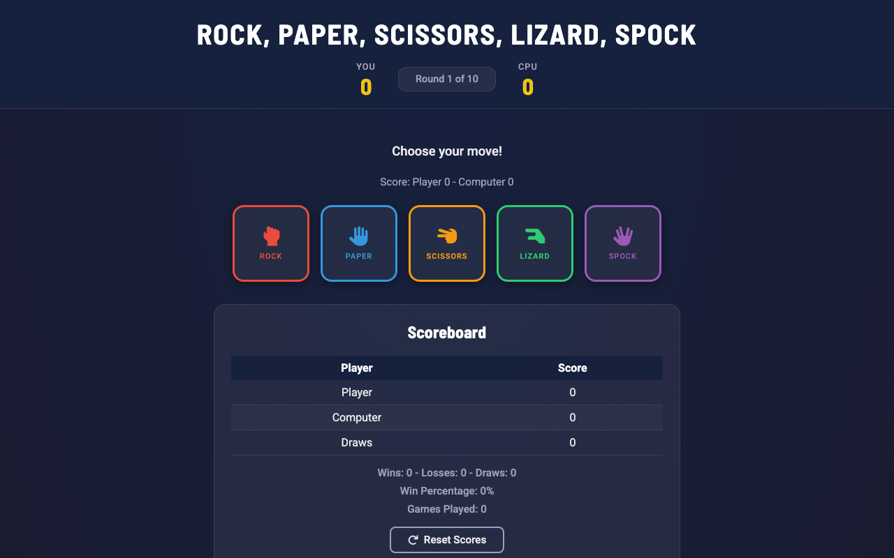
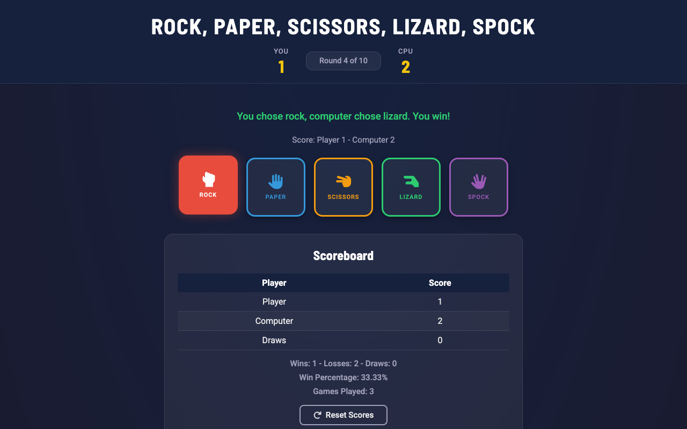
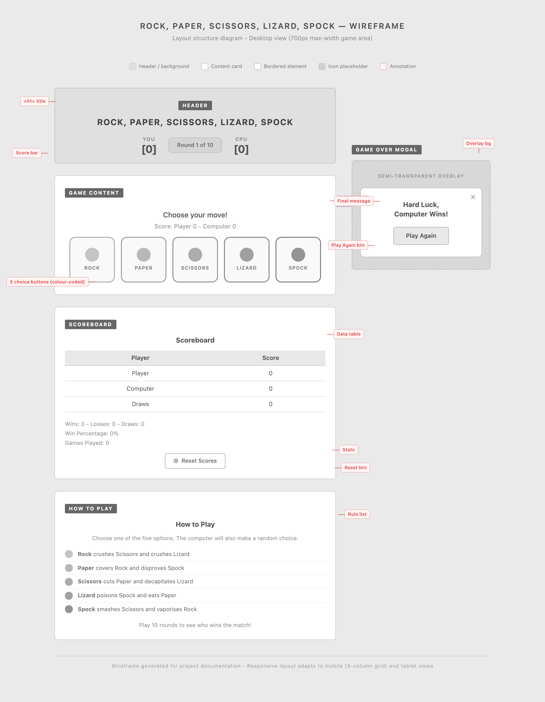
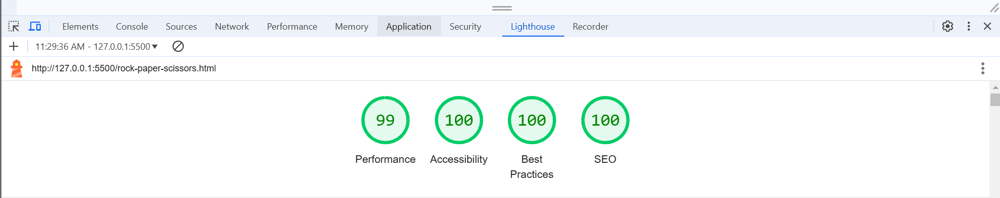

# Rock, Paper, Scissors, Lizard, Spock

## Introduction

Rock, Paper, Scissors, Lizard, Spock is an extended version of the traditional Rock, Paper, Scissors game, designed to provide more complexity and fun. This web-based game features a responsive design, engaging visuals, and an intuitive user interface.

## Table of Contents

- [Introduction](#introduction)
- [Target Audience](#target-audience)
- [Features](#features)
- [Wireframes](#wireframes)
- [Screenshots](#screenshots)
- [Responsive Design](#responsive-design)
- [Testing](#testing)
- [Installation](#installation)
- [Project Structure](#project-structure)
- [Dependencies](#dependencies)
- [Credits](#credits)
- [License](#license)

## Target Audience

This game is designed for:

- **Casual Gamers**: Anyone looking for a fun and quick game to play in their free time.
- **Fans of Classic Games**: Individuals who enjoy traditional games with a modern twist.
- **Developers and Students**: Those looking to learn and understand JavaScript, CSS, and HTML by examining a practical example.

## Features

- **Interactive Gameplay**: Players can choose between Rock, Paper, Scissors, Lizard, or Spock, and the game will determine the winner.
- **Scoreboard**: Tracks the player's and the computer's scores, as well as win ratios and percentages.
- **Responsive Design**: Ensures a seamless experience across different devices, including desktops, tablets, and mobile phones.
- **Stylish Interface**: Uses Font Awesome icons and CSS animations for a visually appealing experience.
- **Reset Function**: Allows players to reset scores and start fresh at any time.

## Wireframes

The following wireframes outline the key pages of the game:

- **Home Page**: Includes the title, game options, and score display.
- **Game Page**: Displays the game interface with interactive buttons for player choices.

## Screenshots

- **Home Page**: Showcases the main interface with game options and scores.

- **Game Page**: Displays the interactive game buttons and real-time score updates.


## Responsive Design

The game is fully responsive and adapts beautifully to different screen sizes, ensuring a seamless experience across desktops, tablets, and mobile devices.

- **Responsive Design Screenshot**: Demonstrates how the game looks on various devices.


## Responsive Design Test
- **Responsive Design Test**: Shows the responsiveness of the site on multiple devices.


## Testing

The game has undergone several manual tests to ensure that it works as intended on various devices and browsers. Below are the key areas of testing:

1. **Responsiveness**
   - **Tested on**: Desktop, Laptop, Tablet, and Mobile devices.
   - **Outcome**: The game is fully responsive and displays correctly on all screen sizes.

2. **Cross-Browser Compatibility**
   - **Tested Browsers**:
     - Google Chrome
     - Mozilla Firefox
     - Microsoft Edge
     - Safari
   - **Outcome**: The game works consistently across all browsers.

3. **Form Validation**
   - **Tested Areas**:
     - Player move selection
     - Score updates
   - **Outcome**: The game logic works as expected, and scores are updated correctly.

4. **Navigation Links**
   - **Tested Links**: Home, Game
   - **Outcome**: All navigation links work as expected.

5. **Performance Testing**
   - **Tested using Lighthouse**:
     - **Performance**: 99
     - **Accessibility**: 100
     - **Best Practices**: 100
     - **SEO**: 100


## Installation

To run this project locally, follow these steps:

1. **Clone the repository**:
   ```bash
   git clone https://github.com/yourusername/rock-paper-scissors-lizard-spock.git
2. **Open the Game**: Launch the `index.html` file in your web browser.
3. **Choose Your Move**: Click on one of the buttons to select Rock, Paper, Scissors, Lizard, or Spock.
4. **View Results**: See the game results and updated scores on the screen.
5. **Reset Scores**: Click the "Reset Scores" button to reset the game and start fresh.

## Project Structure
rock-paper-scissors-lizard-spock/
├── index.html           # HTML structure
├── style.css            # CSS styles
└── script.js            # JavaScript logic

## Dependencies
Font Awesome: Used for icons.

Google Fonts: Roboto font used for styling.

## Credits
This project was made possible with the help of various resources for learning HTML, CSS, and JavaScript:

W3Schools: Comprehensive tutorials on web development.

MDN Web Docs: Excellent documentation for web standards and best practices.

Microsoft Copilot: Provided guidance on project structure and content.

## License
This project is licensed under the MIT License. See the LICENSE file for more information.
